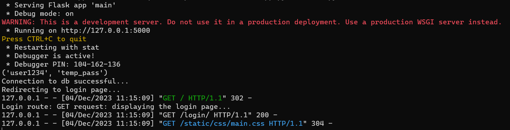

# Finance-Tracker-App
Finance Tracker App for CS 1530 Software Engineering

# How to run the web application (Windows):

After cloning the repository:

1. Make sure you have Python installed
2. Activate the virtual environment by opening the terminal (preferably in VSCode) and while in the repository's directory, type .\Scripts\activate (this command is Windows only)
    * Important Note: Some Windows users will get an error in the above command. One possible cause of such problem is the execution policy in your computer. To check what policy you have in your computer and change it if necessary is shown below:
        1. Select Start > All Programs > Windows PowerShell version > Windows PowerShell.
        2. Type Set-ExecutionPolicy RemoteSigned to set the policy to RemoteSigned.
        3. Type Set-ExecutionPolicy Unrestricted to set the policy to Unrestricted.
        4. Type Get-ExecutionPolicy to verify the current settings for the execution policy.
        5. Type Exit.
3. You should see (Finance-Tracker-App) next to your command line now
4. Execute the following commands in the command line:

```pip install psycopg2```

```pip install flask```

5. Install [version 10.23 of PostgresSQL](https://www.enterprisedb.com/downloads/postgres-postgresql-downloads)
6. Launch the installer after it is done downloading. Set the password to **sie_final_project**. Leave the default port to be 5432.
7. After the installation is complete, search for **psql** in the Windows search bar and launch it.
8. The new command line should contain the first line of the following:

9. Continue to hit Enter until you are prompted to enter the password. Enter **sie_final_project** and leave this running.
10. Run the main python script main.py (python main.py) in the command line that has (Finance-Tracker-App).
11. CTRL + click on the link where it says "Running on <link>" to open the web app
12. If everything is setup correctly, you should the see the following output in the command line:  

